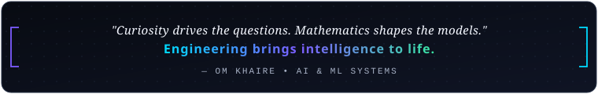

<!-- ================================================================= -->
<!-- OM KHAIRE - B.TECH ARTIFICIAL INTELLIGENCE & MACHINE LEARNING    -->
<!-- GITHUB PROFILE README | SANJIVANI UNIVERSITY                     -->
<!-- ================================================================= -->

<div align="center">

<!-- HERO BANNER (CUSTOM SVG ASSET) -->
<a href="https://github.com/khaireom007">
  
</a>

<br/><br/>

<!-- PRIMARY IDENTITY HEADER -->
<h1>OM KHAIRE</h1>

<p>
  <b>B.Tech — Artificial Intelligence &amp; Machine Learning</b><br/>
  <b>Sanjivani University</b>
</p>

<p>
  <i>Building intelligent systems. Exploring machine learning. Turning data into insight.</i>
</p>

<!-- IDENTITY BADGES STRIP -->
<p>
  
  
  
  
  
</p>

<!-- QUICK CONNECT ACTION BAR -->
<p>
  <!-- Verified LinkedIn Profile -->
  <a href="https://www.linkedin.com/in/om-khaire-340790379" target="_blank" rel="noopener noreferrer">
    
  </a>
  &nbsp;
  <!-- Verified GitHub Profile -->
  <a href="https://github.com/khaireom007" target="_blank" rel="noopener noreferrer">
    
  </a>
  &nbsp;
  <!-- Editable Email Link Placeholder -->
  <!-- TO USER: Replace 'your.email@example.com' with your active email address -->
  <a href="mailto:your.email@example.com">
    
  </a>
</p>


</div>

<br/>

<!-- ================================================================= -->
<!-- SECTION: ABOUT ME                                                 -->
<!-- ================================================================= -->

## 🔬 About Me

I am an **Artificial Intelligence and Machine Learning** undergraduate at **Sanjivani University**, dedicated to exploring the computational mathematics and engineering principles that power modern intelligent systems. 

My technical journey centers on understanding how machine learning algorithms generalize from data, how deep learning architectures model complex representations, and how to engineer dependable software pipelines that translate theoretical algorithms into impactful real-world applications.

### 🎯 Core Focus Areas & Interests

- 🧠 **Machine Learning & Statistical Modeling:** Supervised & unsupervised learning, predictive modeling, feature engineering, and model evaluation metrics.
- ⚡ **Deep Learning Architectures:** Artificial neural networks, convolutional networks for visual patterns, and transformer-based sequence modeling.
- 🤖 **Generative AI & Modern LLM Tooling:** Prompt engineering, semantic search, vector embeddings, and Retrieval-Augmented Generation (RAG) concepts.
- 📊 **Data Science & Exploratory Analytics:** Data wrangling, exploratory data analysis (EDA), hypothesis formulation, and statistical visualization.
- ⚙️ **AI Systems & Software Foundations:** Clean Python engineering, modular code design, RESTful service concepts, and version-controlled collaboration.

---

<!-- ================================================================= -->
<!-- SECTION: AI/ML DOMAIN MAP                                         -->
<!-- ================================================================= -->

## 🌐 AI / ML Domain Map

> *A structured landscape of the Artificial Intelligence and Machine Learning domains actively explored, studied, and implemented throughout my academic and project journey.*

<table>
  <thead>
    <tr>
      <th width="33%" align="left">Domain</th>
      <th width="67%" align="left">Key Subfields &amp; Conceptual Foundations</th>
    </tr>
  </thead>
  <tbody>
    <tr>
      <td><b>01. Artificial Intelligence</b></td>
      <td>Intelligent Agents · Search &amp; Optimization · Knowledge Representation · Automated Reasoning · Decision-Making Systems · Constraint Satisfaction</td>
    </tr>
    <tr>
      <td><b>02. Machine Learning</b></td>
      <td>Supervised &amp; Unsupervised Learning · Classification &amp; Regression · Clustering · Feature Engineering · Cross-Validation · Hyperparameter Tuning · Ensemble Methods</td>
    </tr>
    <tr>
      <td><b>03. Deep Learning</b></td>
      <td>Artificial Neural Networks (ANN) · Multilayer Perceptrons (MLP) · Convolutional Neural Networks (CNN) · Recurrent Networks (RNN / LSTM) · Transformers &amp; Attention · Transfer Learning</td>
    </tr>
    <tr>
      <td><b>04. Generative AI &amp; LLMs</b></td>
      <td>Large Language Models · Vector Databases · Semantic Embeddings · Retrieval-Augmented Generation (RAG) · Semantic Search · AI Agents · Prompt Design</td>
    </tr>
    <tr>
      <td><b>05. Natural Language Processing</b></td>
      <td>Text Preprocessing &amp; Tokenization · Sentiment Analysis · Text Classification · Named Entity Recognition (NER) · Information Retrieval · Language Modeling</td>
    </tr>
    <tr>
      <td><b>06. Computer Vision</b></td>
      <td>Image Preprocessing · Feature Extraction · Image Classification · Object Detection Foundations · Image Segmentation · Convolutional Filters</td>
    </tr>
    <tr>
      <td><b>07. Data Science &amp; Analytics</b></td>
      <td>Exploratory Data Analysis (EDA) · Data Cleaning &amp; Imputation · Probability &amp; Statistics · Linear Algebra &amp; Calculus · Data Visualization · Interpretability</td>
    </tr>
    <tr>
      <td><b>08. Reinforcement Learning</b></td>
      <td>Markov Decision Processes (MDP) · Reward Functions · Policy Learning · Value-Based &amp; Policy-Based Exploration · Sequential Decision-Making</td>
    </tr>
    <tr>
      <td><b>09. AI Engineering &amp; Deployment</b></td>
      <td>REST APIs &amp; FastAPI · Model Serialization (Pickle/ONNX) · Docker Fundamentals · Git Version Control · Experiment Tracking · MLOps Fundamentals</td>
    </tr>
    <tr>
      <td><b>10. Responsible &amp; Secure AI</b></td>
      <td>Explainable AI (XAI) · Model Fairness &amp; Bias Mitigation · Data Privacy Principles · Model Robustness &amp; Verification · Safe AI Practices</td>
    </tr>
  </tbody>
</table>

<br/>

---

<!-- ================================================================= -->
<!-- SECTION: TECHNICAL STACK                                          -->
<!-- ================================================================= -->

## 🛠️ Technical Stack

A curated view of programming languages, libraries, environments, and developer tools actively utilized in coursework, self-directed exploration, and software projects:

### 💻 Programming Languages
<p>
  
  
  
  
  
</p>

### 🧠 Machine Learning & Scientific Computing
<p>
  
  
  
  
  
  
</p>

### ⚡ Deep Learning & Modern AI (Active Learning & Applied Practice)
<p>
  
  
  
</p>

### 🛠️ Developer Environment, Systems & Tools
<p>
  
  
  
  
  
  
</p>

### 🗄️ Backend & Databases
<p>
  
  
  
</p>

---

<!-- ================================================================= -->
<!-- SECTION: FEATURED PROJECTS                                        -->
<!-- ================================================================= -->

## 🚀 Featured Projects

Real repositories and engineering builds demonstrating software structure, data workflows, and applied systems:

<table>
  <thead>
    <tr>
      <th width="45%" align="left">Project &amp; Overview</th>
      <th width="30%" align="left">Tech Stack</th>
      <th width="25%" align="center">Repository &amp; Links</th>
    </tr>
  </thead>
  <tbody>
    <tr>
      <td>
        <b>📚 Smart Library Management System</b><br/>
        An intelligent management system designed to streamline catalog operations, book issuing and returns, inventory tracking, and user data management through structured database schemas and workflow automation.
      </td>
      <td>
        <code>Python</code> · <code>Database Management</code> · <code>Automation</code> · <code>OOP</code>
      </td>
      <td align="center">
        <a href="https://github.com/khaireom007/Smart-library-management-system" target="_blank" rel="noopener noreferrer">
          
        </a>
      </td>
    </tr>
  </tbody>
</table>

### 🧪 Currently In Development & Planned AI Builds

Projects currently being structured, prototyped, and refined for upcoming release:

<table>
  <thead>
    <tr>
      <th width="35%" align="left">Proposed Project</th>
      <th width="45%" align="left">Technical Objective</th>
      <th width="20%" align="center">Status</th>
    </tr>
  </thead>
  <tbody>
    <tr>
      <td><b>📊 ML Model Evaluation Benchmark Suite</b></td>
      <td>Comparative evaluation framework comparing multiple classification/regression algorithms across standardized datasets with automated metric visualizers.</td>
      <td align="center"><code>Active Prototyping</code></td>
    </tr>
    <tr>
      <td><b>🔍 Intelligent Document RAG Pipeline</b></td>
      <td>Document ingestion, semantic chunking, embedding generation with vector search, and context-grounded retrieval for question answering.</td>
      <td align="center"><code>Architecture Phase</code></td>
    </tr>
    <tr>
      <td><b>👁️ Computer Vision Defect / Object Detector</b></td>
      <td>Convolutional model pipeline for image preprocessing, feature identification, and target categorization with performance benchmarking.</td>
      <td align="center"><code>Dataset Preparation</code></td>
    </tr>
  </tbody>
</table>

---

<!-- ================================================================= -->
<!-- SECTION: LEARNING AND RESEARCH INTERESTS                         -->
<!-- ================================================================= -->

## 📚 Learning & Research Interests

As an AI & ML undergraduate, my academic curiosity is oriented toward understanding how cutting-edge research transitions into practical computing systems:

- 📐 **Foundational Mathematical Grounding:** Investigating how matrix decomposition, gradient descent variants, and loss surfaces influence model convergence and generalization.
- ⚡ **Efficient Machine Learning:** Exploring methods to optimize model inference latency, reduce parameter redundancy, and enable efficient local deployment.
- 🔍 **Explainable AI (XAI):** Investigating interpretability techniques (such as feature importance, SHAP/LIME principles) to demystify black-box neural networks.
- 🔄 **Modern Retrieval-Augmented Generation (RAG):** Studying chunking strategies, hybrid retrieval mechanisms, and vector database indexing algorithms.

---

<!-- ================================================================= -->
<!-- SECTION: GITHUB STATISTICS & ANALYTICS                            -->
<!-- ================================================================= -->

## 📊 GitHub Analytics

<!-- 
  NOTE ON EXTERNAL WIDGETS:
  These widgets dynamically fetch verified data from the official GitHub API for 'khaireom007'.
  Custom dark palette parameters match the profile's futuristic AI lab theme:
  Background: #080B12 | Title: #7C5CFF | Text: #A7B1C5 | Accent/Icon: #00D9FF | Border: #273247
  To customize or disable any card, edit or comment out the corresponding  tag below.
-->

<div align="center">
  <table border="0">
    <tr>
      <td align="center" width="50%">
        
      </td>
      <td align="center" width="50%">
        
      </td>
    </tr>
    <tr>
      <td align="center" colspan="2">
        <br/>
        
      </td>
    </tr>
  </table>
</div>

---

<!-- ================================================================= -->
<!-- SECTION: CONTRIBUTION GRAPH                                       -->
<!-- ================================================================= -->

## 📈 Activity & Contribution Graph

<!-- 
  NOTE ON CONTRIBUTION CALENDAR:
  This chart dynamically displays the GitHub contribution frequency for 'khaireom007'
  using the violet/cyan aesthetic. If external rendering ever delays, visit 
  https://github.com/khaireom007 for the real-time native contribution graph.
-->

<div align="center">
  <a href="https://github.com/khaireom007">
    
  </a>
  <p align="center"><i>Interactive activity records available directly on <a href="https://github.com/khaireom007">@khaireom007</a></i></p>
</div>

---

<!-- ================================================================= -->
<!-- SECTION: LEARNING ROADMAP                                         -->
<!-- ================================================================= -->

## 🗺️ AI / ML Learning Roadmap

A structured progression guiding my continuous skill acquisition across academic semesters:

```
[ PHASE 01: FOUNDATIONS ] ─────────────────────────┐
  • Linear Algebra, Multivariate Calculus & Stats   │  [ IN PROGRESS / SOLIDIFYING ]
  • Python Core, Object-Oriented Programming        │
  • Data Structures & Algorithmic Complexity        │
                                                    ▼
[ PHASE 02: MACHINE LEARNING ] ─────────────────────┐
  • Exploratory Data Analysis & Preprocessing       │  [ ACTIVE FOCUS ]
  • Supervised Learning (Regression / Trees / SVM)  │
  • Unsupervised Clustering & Dimensionality Red.   │
  • Model Validation, Bias-Variance Tradeoff        │
                                                    ▼
[ PHASE 03: DEEP LEARNING ] ────────────────────────┐
  • Neural Network Backpropagation & Optims         │  [ EXPLORING & EXPERIMENTING ]
  • Convolutional Networks for Vision Tasks         │
  • Recurrent Architectures & Sequence Models       │
  • PyTorch & TensorFlow Framework Foundations      │
                                                    ▼
[ PHASE 04: GENERATIVE AI & ADVANCED SYSTEMS ] ─────┐
  • Transformer Mechanics & Self-Attention          │  [ UPCOMING MILESTONES ]
  • Semantic Search, Embeddings & Vector DBs        │
  • Retrieval-Augmented Generation (RAG) Systems    │
                                                    ▼
[ PHASE 05: AI ENGINEERING & DEPLOYMENT ] ──────────┘
  • Model Serving with FastAPI & Serialization
  • Docker Containerization & Pipeline Automation
  • Responsible AI, Robustness & Monitoring
```

---

<!-- ================================================================= -->
<!-- SECTION: CURRENTLY WORKING ON                                     -->
<!-- ================================================================= -->

## 🔭 Currently Exploring

- 📖 Deepening grasp of **statistical learning foundations** and algorithmic optimization techniques.
- 💻 Building clean, modular **Python data processing pipelines** with NumPy and Pandas.
- 🔬 Experimenting with classical ML model training, cross-validation strategies, and metric evaluation.
- 🧪 Architecting practical projects for the **B.Tech AI & ML** curriculum at Sanjivani University.
- 🌐 Participating in open-source developer workflows and maintaining disciplined Git version control.

---

<!-- ================================================================= -->
<!-- SECTION: CONNECT WITH ME                                          -->
<!-- ================================================================= -->

## 📬 Connect With Me

Whether you want to discuss Artificial Intelligence, Machine Learning algorithms, collaborative academic projects, or tech ideas, feel free to connect:

<div align="center">

  <!-- Verified LinkedIn Profile with official badge -->
  <a href="https://www.linkedin.com/in/om-khaire-340790379" target="_blank" rel="noopener noreferrer">
    
  </a>
  &nbsp;&nbsp;
  <!-- Verified GitHub Profile -->
  <a href="https://github.com/khaireom007" target="_blank" rel="noopener noreferrer">
    
  </a>
  &nbsp;&nbsp;
  <!-- Editable Email Badge Placeholder -->
  <!-- TO USER: Replace 'your.email@example.com' with your actual email address -->
  <a href="mailto:your.email@example.com">
    
  </a>
  &nbsp;&nbsp;
  <!-- Editable Kaggle / Portfolio Placeholder -->
  <!-- TO USER: Add your Kaggle username when ready -->
  <a href="https://kaggle.com" target="_blank" rel="noopener noreferrer">
    
  </a>

</div>

<br/>

<!-- ================================================================= -->
<!-- SECTION: FINAL SIGNATURE                                          -->
<!-- ================================================================= -->

<div align="center">
  
  <br/><br/>
  <p>
    <sub>Designed with precision for the GitHub presence of <b>Om Khaire</b> · Sanjivani University</sub>
  </p>
</div>
